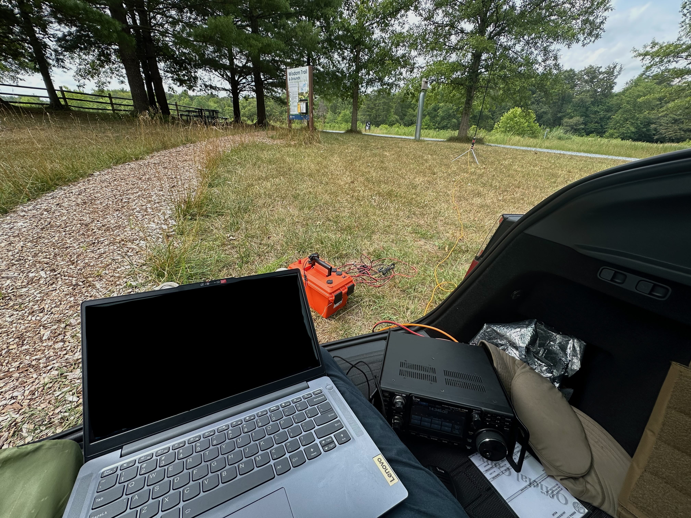

+++
date = "2024-07-21T09:30:00-05:00"
title = "Operating Notes - POTA at Patuxent National Wildlife Refuge (US-0334)"
categories = [
    "POTA",
    "Operating Notes"
]
tags = [
    "US Fish & Wildlife Service",
    "Maryland",
    "Successful Activation"
]
parks = [ "US-0334" ]
lat = 38.9944
long = -76.895
zoom = 5
layout = "operating-notes-pota"

successful = true
radio = "Icom IC-7300"
antenna = "Rez Recon 40"
weather = "Sunny, High 80 Degrees F (30-33c)"
time = "11:30-13:45 Eastern (15:30-17:45 UTC)"
photo_credit = "Myself"

[contacts]
phone = 36
#data = 1
park2park = 20
+++

The drive to the visitors centre was great, really nice to know that this is here so close to DC, and central Maryland. As per the POTA directions I checked in with the staff, who directed me towards the far end of the carpark and suggested that would be the best place to activate from. Very freindly staff!

I didnt realise until later, that there were some park benches near where I parked, and because of this I ended up operating from the trunk of my car, which was not the most comfy!

This time I atempted to use HAMRS again for logging, but it appears to like to go to the end of the input box if you replace a character or two, which is a bit unintuitive. This ended up with me making a fair few mistakes on the logging side.

Setting up, took about 10 minutes this time.

As the weather was quite warm and I was in the boot^WTrunk I enabled my car's "camp mode". Whilst the blast of AC'ed air was a welcome relief, it unfortuantly caused a large amount of QRM. I'm not sure if it's the car's inverter or the AC, I suspect the former.

## What went well
The staff at the wildlife refuge were extremley freindly and very welcoming of POTA activators.

## When went badly
Logging using HAMRS was, for me, a excersise in frustration. I see why people like the application, as there are some really nice features, however some of the "helping" features end up with some odd things happening. Having US-0123 in the park feild and needing to change that to US-0453 I would normally put my text cursor at the end of the 5, hit backspace twice and type 45. In this case it unfortuantly moved to the end of the field after the first backspace, resulting in a US-0145.

## What could be improved
Not having a seat was a bad decision, as I ended up with my leg falling asleep frequently and having to get up and walk about for a few minutes every 20 or so minutes. My Trunk's matts were not comfortable at all, luckily there was enough room for my legs to fit inside the car.