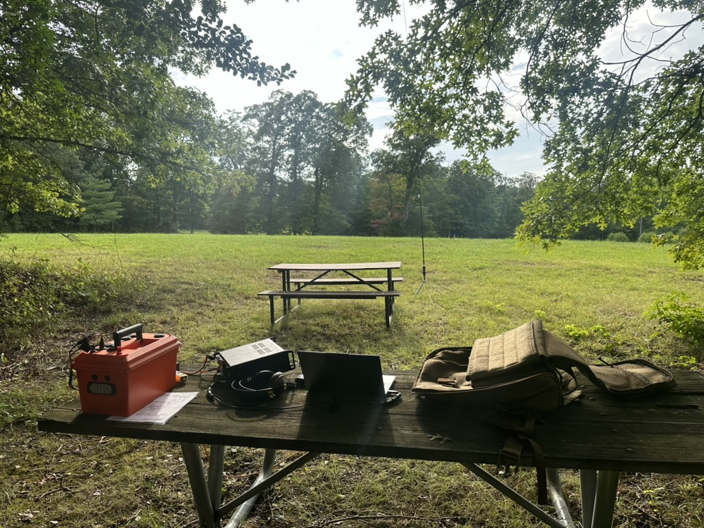

+++
date = "2024-07-28T12:00:00-05:00"
title = "Operating Notes - POTA at Meadowood BLM Special Recreation Management Area (US-9937)"
categories = [
    "POTA",
    "Operating Notes"
]
tags = [
    "US Bureau of Land Management",
    "Virginia",
    "Successful Activation"
]
parks = [ "US-9937" ]
lat = 38.6724
long = -77.1978
zoom = 5
layout = "operating-notes-pota"

successful = true
radio = "Icom IC-7300"
antenna = "Rez Recon 40"
weather = "Sunny, High 80 Degrees F (30-33c)"
time = "14:30-18:15 Eastern (20:30-22:15 UTC)"
photo_credit = "Google Maps"

[contacts]
phone = 11
#data = 1
park2park = 9
+++

I drove to the BLM Lower Potomac Field Station to try and make sure that it was going to be allowed for me to setup for a POTA activation in the "park" but unfortunatly the station was closed when I arrived.

With this in mind I looked on the map and found a nice area called "Hidden Pond", driving there I managed to see a couple of deer on the road (and eventually they moved to the side of the road, a blessing and a curse of an EV making little to no noise, they didnt seem to be too interested at all!). I arrived and took the trail. About 1KM from the trailhead there were a number of benches in the shade which were perfect for me to setup on.

Setup was again about 15 minutes.

The bands were not favourable at all. I had a few contacts, but oddly was getting peaks of noise aproximatly S9 when the sun was not behind clouds. However, I still managed to make a number of contacts during this.

Today I also used DF3CB's [FLE](https://df3cb.com/fle/) for logging which again worked well for my self, with this I think being my prefered method of loging for POTA.

Converting logs for upload was as simple as saving the file as an ADIF and uploading. I've also updated my scripts that generate the file used to draw the map at the bottom of this post, and insert the table at the end of the post, to also use this ADIF, so I have a much simpler log processing process. The only challenge will be for a multiple park activation, however this should be saving the file again with a new mypota entry.

When leaving I did have an individual who was a bit hostile to me, with what appeared to be animosity either towards my self (despite never having interacted with them before), or the hobby. I attempted to diffuse the situation, but ended up leaving with a bit of a downer on the experience.

## What went well
I was able to take the trail in the heat and humidity, and after having a heavy lunch!

Logging worked a lot better this time.

## When went badly

The interatcion with the individual would make me reconsider how I setup, perhaps being near the trail is not the right move. I will carry a more "official" looking copy of my license in the future, as my laminated versions of the "Official Copy" from the FCC's site are clearly not deemed to be "Official" by this type of individual.

Band conditions were not ideal!

## What could be improved
Using the rest room before heading to the park! I had planned to use the facilities at the field station, but obviously as that was closed that was not an option.

Exploring different bands should be something that I look into more.